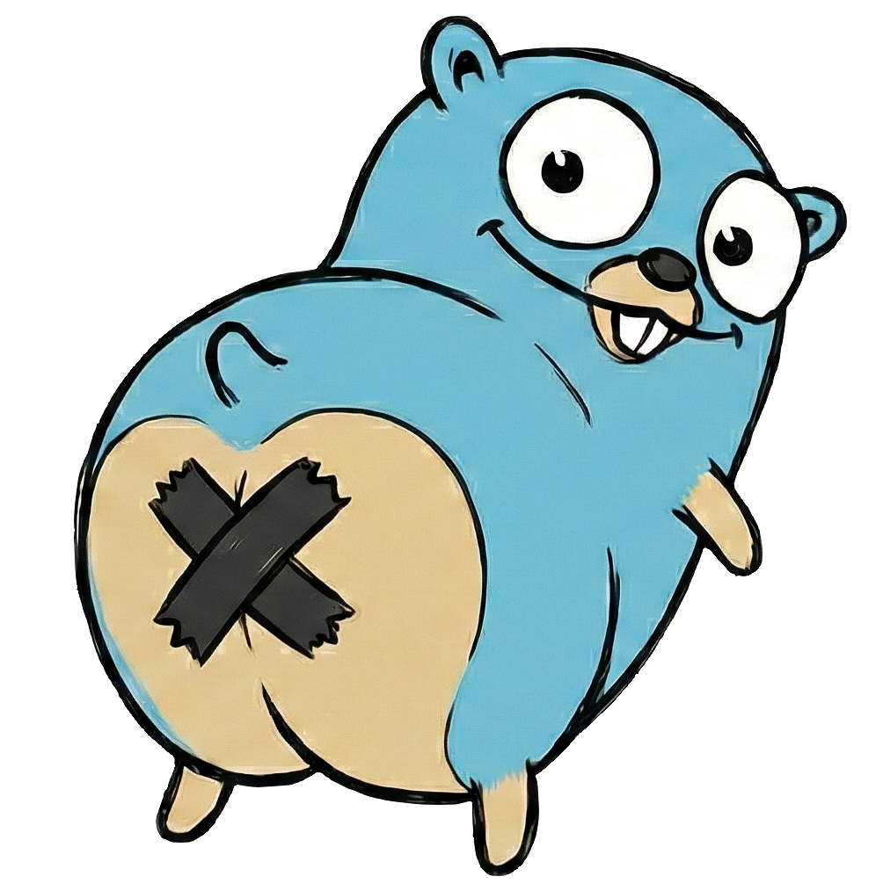

# bunghole

<p align="center">
  
</p>

Remote desktop streaming over WebRTC. Captures a display, encodes with hardware-accelerated H.264/H.265, and streams to a browser with mouse, keyboard, and clipboard support.

## Platforms

**[Linux](ARCHITECTURE_LINUX.md)** — Captures X11 via NvFBC (zero-copy GPU) or MIT-SHM. Encodes with NVENC or CPU fallback. Full input injection, bidirectional clipboard, PulseAudio/PipeWire audio. Optional headless mode with its own Xorg + GNOME Shell stack.

**[macOS](ARCHITECTURE_MACOS.md)** — Captures via ScreenCaptureKit, encodes with VideoToolbox. Desktop mode captures the host screen. VM mode (`--vm`) runs a full macOS VM via Virtualization.framework with Metal GPU — a WebRTC-based macOS terminal server.

## Features

- **Low-latency video** via hardware encoding (NVENC on Linux, VideoToolbox on macOS)
- **H.264 and H.265** codec support
- **Opus audio** capture (Linux — PulseAudio/PipeWire)
- **Full input** — mouse, keyboard, scroll
- **Clipboard sync** — bidirectional copy/paste
- **Viewer streams** — multiple simultaneous view-only connections
- **macOS VM mode** — isolated macOS desktop with Metal GPU
- **Headless mode** — start Xorg + GNOME Shell + PipeWire (Linux)
- **Single binary** — everything embedded, including the web client

## Quick Start

```
# Build
mkdir build && cd build && cmake .. && make

# Run (Linux — capture existing display)
bunghole --token SECRET --display :0

# Run (macOS — capture host desktop)
bunghole --token SECRET
```

Open `http://<host>:8080` in a browser, enter the token, and connect. Click the video to focus input; press Escape to release.

See the platform docs for full build instructions, flags, and examples: **[Linux](ARCHITECTURE_LINUX.md)** | **[macOS](ARCHITECTURE_MACOS.md)**

## Protocol

Uses [WHEP](https://www.ietf.org/archive/id/draft-murillo-whep-03.html) (WebRTC-HTTP Egress Protocol) for session negotiation. All endpoints require `Authorization: Bearer <token>`.

### Controller (interactive)

The controller session provides video, audio, and data channels for mouse/keyboard/clipboard input. Only one controller is active at a time — a new connection replaces the previous one.

| Endpoint | Method | Purpose |
|----------|--------|---------|
| `/whep` | POST | Send SDP offer, receive SDP answer |
| `/whep/{id}` | PATCH | Trickle ICE candidates |
| `/whep/{id}` | DELETE | Disconnect |

### Viewer (view-only)

Viewer sessions receive video and audio only — no data channels, no input. Multiple viewers can connect simultaneously. The capture/encode pipeline is shared: a single encode feeds all connections (controller + viewers) via track-level broadcast.

| Endpoint | Method | Purpose |
|----------|--------|---------|
| `/whep/view` | POST | Send SDP offer, receive SDP answer |
| `/whep/view/{id}` | PATCH | Trickle ICE candidates |
| `/whep/view/{id}` | DELETE | Disconnect |

The pipeline starts when the first session (controller or viewer) connects and stops when the last one disconnects. Viewers continue receiving video if the controller disconnects.

### Connecting a hardware decoder

To connect a Teradek Prism or similar WHEP-capable hardware decoder as a viewer:

1. Point the device at `http://<host>:8080/whep/view`
2. Set the `Authorization` header to `Bearer <token>`
3. The device receives the H.264/H.265 + Opus stream — no data channels needed

Multiple decoders can connect simultaneously.

## Browser Compatibility

- **H.264**: All modern browsers
- **H.265**: Chrome 130+, Safari, Edge
